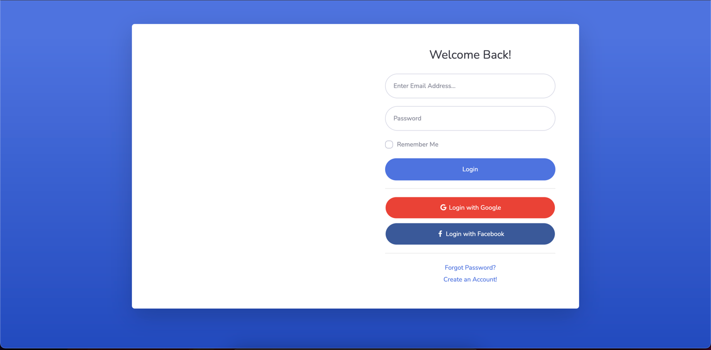
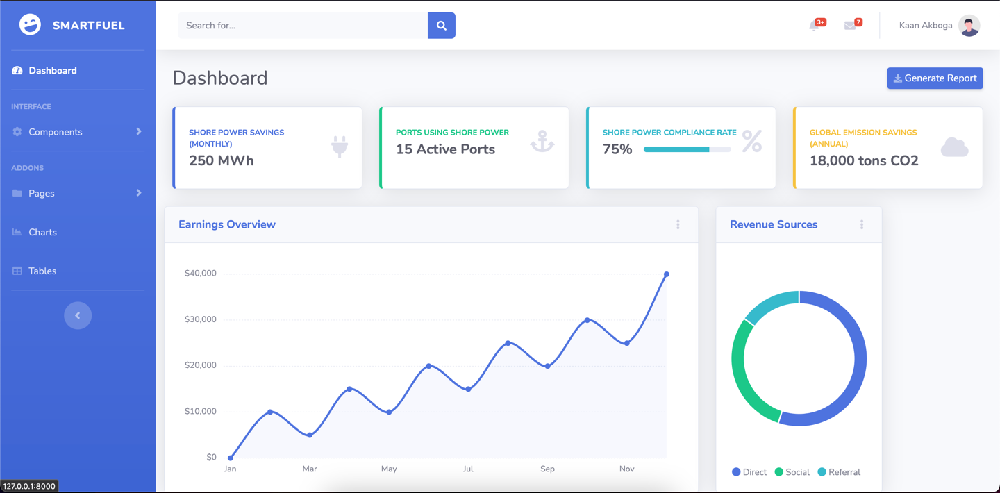
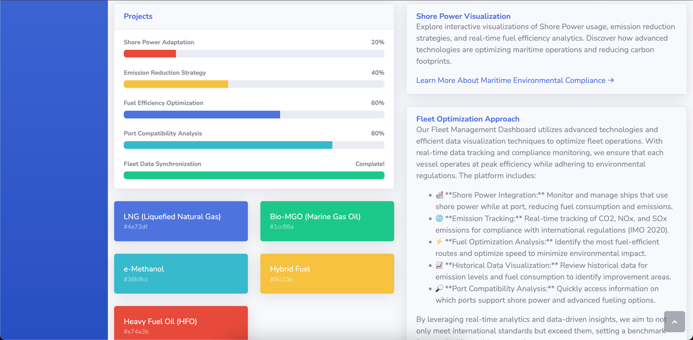
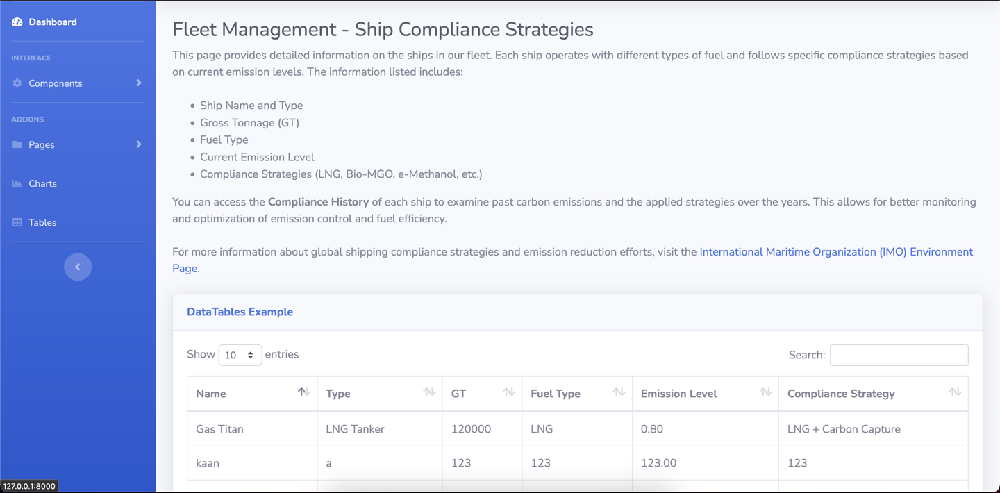
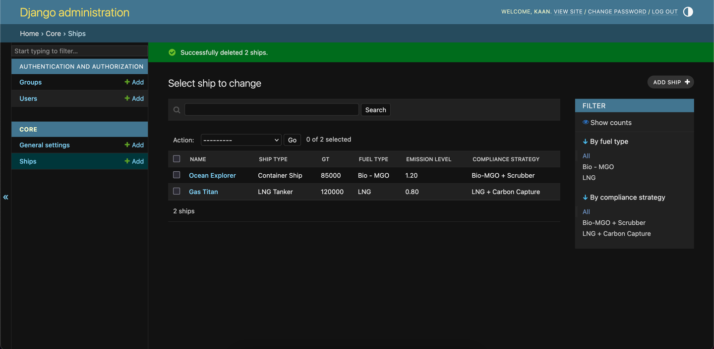

# 🌊 Fleet Management Dashboard

Fleet Management Dashboard is a Django-based web application designed to manage and monitor ships and their environmental compliance data in line with maritime emission strategies (e.g., LNG, bio-MGO, e-methanol).

## 🚀 Features

- ✅ Ship listing with type, GT, fuel type, emission level, and compliance strategy
- ➕ Add new ships via a form interface
- 📊 Admin panel for ship and settings management
- 🖼️ UI enhanced with Bootstrap-based SB Admin 2 theme
- 🔍 Search, filter, and view utilities and styled components

---

## 📷 Screenshots

You can include screenshots in this section. For example:







---

## 📁 Project Structure

```
core/
├── admin.py          # Admin configuration for Ship & GeneralSetting
├── models.py         # Ship & GeneralSetting models
├── views.py          # Page logic and form processing
├── templates/        # HTML templates (Bootstrap themed)
└── static/           # CSS, JS, images
```

---

## ⚙️ Setup Instructions

1. **Clone the repository**

```bash
git clone https://github.com/yourusername/fleet-dashboard.git
cd fleet-dashboard
```

2. **Create a virtual environment**

```bash
python -m venv .venv
source .venv/bin/activate  # On Windows: .venv\Scripts\activate
```

3. **Install dependencies**

```bash
pip install -r requirements.txt
```

4. **Apply migrations**

```bash
python manage.py migrate
```

5. **Create superuser (admin)**

```bash
python manage.py createsuperuser
```

6. **Run the server**

```bash
python manage.py runserver
```

Visit `http://127.0.0.1:8000` to access the application.

---

## 🛠️ Admin Panel

Accessible via: [http://127.0.0.1:8000/admin](http://127.0.0.1:8000/admin)

Manage `Ship` and `GeneralSetting` entries easily.

---

## 📄 Models

### `Ship`

| Field                | Type    | Description                       |
|---------------------|---------|-----------------------------------|
| name                | Char    | Name of the ship                  |
| ship_type           | Char    | Type of ship (e.g., tanker)       |
| gt                  | Integer | Gross Tonnage                     |
| fuel_type           | Char    | Type of fuel used                 |
| emission_level      | Char    | Emission category or level        |
| compliance_strategy | Char    | Strategy for FuelEU compliance    |

---

## 📌 Pages

| URL                 | View Function     | Description                        |
|---------------------|-------------------|------------------------------------|
| `/`                 | `index`           | Homepage                           |
| `/login/`           | `login`           | Login screen                       |
| `/register/`        | `register`        | Register screen                    |
| `/forgotpassword/`  | `forgotpassword`  | Password reset screen              |
| `/fleet/`           | `fleet_list`      | Ship listing page                  |
| `/add-ship/`        | `add_ship`        | Ship form submission page          |
| `/tables/`          | `tables`          | Also shows list of ships           |
| `/charts/`, etc.    | `charts`, etc.    | UI utility pages (optional)        |

---

## 💡 Future Improvements

- ✅ Ship edit/delete functionality
- 📈 Emission analytics and reporting
- 🌐 API endpoints for mobile/web integration
- 🧪 Unit tests and CI/CD integration

---

## 📜 License

This project is licensed under the MIT License.
